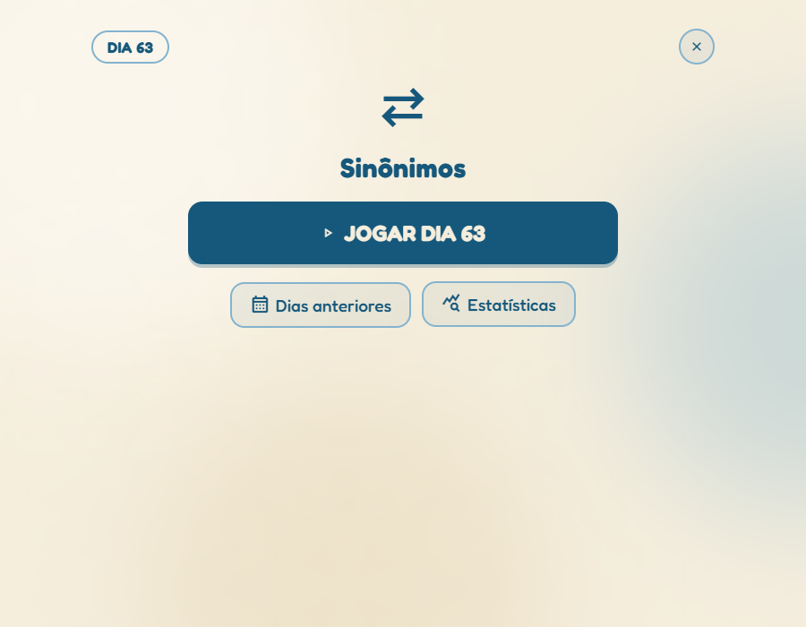
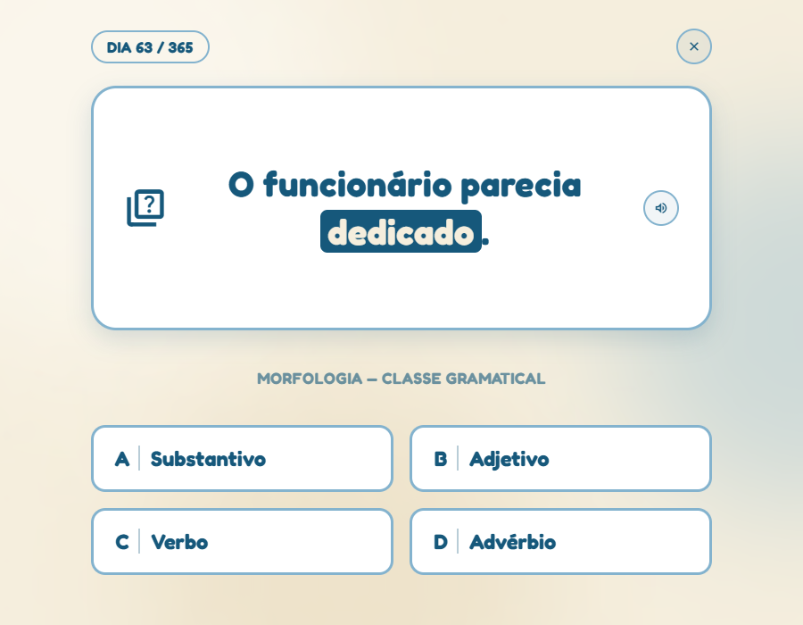

# GRAMMA


Este projeto foi desenvolvido para a matéria de Jogos Digitais do curso de
Sistemas de Informação do Centro Universitário do Rio São Francisco -
UniRios, ministrada pelo Professor Dr. Erick Barros.

GRAMMA é um desafio gramatical e sintático diário, no estilo Wordle/Termo,
focado em três frentes da língua portuguesa: classes gramaticais, funções
sintáticas e sinônimos.

Jogue em: https://glaubermargem.github.io/Gramma/

## Tela Inicial


Tela inicial do jogo, onde o jogador escolhe o modo de estudo do dia:
Morfologia, Sintaxe ou Sinônimos.

## Menu do Modo



Depois de escolher o modo, o jogador acessa o desafio do dia, o
calendário de dias anteriores e as estatísticas daquele modo.

## Interface do Jogo



Interface de uma pergunta, com a frase do dia, a palavra em destaque e as
quatro alternativas de resposta.

## Ajustes e melhorias

O jogo ainda está em desenvolvimento e as próximas atualizações serão
voltadas para as seguintes tarefas:

- Mascote ou fio narrativo leve nas telas de feedback
- Jogo instalável (PWA / manifest.json)
- Testes automatizados do motor de pontuação e do banco de dados
- Camada Canvas/WebGL nos efeitos de celebração

## Pré-requisitos

Não há dependências para jogar: é HTML, CSS e JavaScript puro, sem
build step, sem framework e sem backend. Para rodar localmente, só é
necessário um navegador atual e, opcionalmente, Python ou Node (veja
abaixo o motivo).

## Estrutura do Projeto

- `index.html`: marcação de todas as telas
- `css/style.css`: design system (temas claro/escuro, animações)
- `js/main.js`: orquestração — navegação, eventos, cutscene de abertura
- `js/gameEngine.js`: máquina de estados de uma partida
- `js/scoreEngine.js`: pontuação e bônus de sequência
- `js/storageService.js`: leitura/escrita do progresso (localStorage)
- `js/achievements.js`: catálogo de conquistas
- `js/dataStore.js`: acesso ao banco de frases (morfologia/sintaxe)
- `js/synonymStore.js`: acesso ao banco de sinônimos
- `js/uiController.js`: renderização das telas
- `js/theme.js` / `js/accessibility.js`: tema claro/escuro, tamanho de fonte
- `js/vendor/gsap.min.js`: GSAP (animações), vendorizado localmente
- `scripts/build-data.js`: regenera `js/database.js` e
  `js/synonymsDatabase.js` a partir dos `.json`

## Executando localmente

O jogo usa ES Modules (`<script type="module">`), que a maioria dos
navegadores bloqueia se você abrir o `index.html` direto pelo disco
(`file://`). Sirva a pasta por HTTP:

```
python -m http.server 8000
```

ou, sem instalar nada globalmente:

```
npx serve .
```

Depois abra `http://localhost:8000` no navegador.

## Banco de dados

O conteúdo do jogo (frases de morfologia/sintaxe e palavras de sinônimos)
tem o `.json` como fonte oficial, editável por qualquer pessoa do time:

- `database_completo_365.json`: 365 dias de morfologia e sintaxe
- `database_sinonimos.json`: banco de palavras difíceis do modo Sinônimos

O jogo em si não lê esses `.json` diretamente — ele importa os módulos
`js/database.js` e `js/synonymsDatabase.js`, cópias geradas a partir dos
JSON acima (evita `fetch`/CORS ao abrir o jogo direto pelo `file://`).

Por isso, depois de editar qualquer um dos `.json`, rode:

```
node scripts/build-data.js
```

e comite os `.js` atualizados junto com o `.json`. Se pular esse passo, a
edição fica só no `.json` e nunca aparece dentro do jogo de verdade.

## Concepção do projeto

O desenho do jogo mudou bastante desde a proposta inicial (modo difícil
removido, sinônimos adicionado, paleta de cores refeita, entre outros).
O histórico dessas decisões está em [`CHANGELOG.md`](CHANGELOG.md); os
documentos originais de proposta (`ideia.md`, `ferramentas.md`,
`spec-design-jogo.md`) ficam no repositório como registro histórico.

## Colaboradores

Este projeto foi desenvolvido para a matéria de Jogos Digitais do curso
de Sistemas de Informação do Centro Universitário do Rio São Francisco -
UniRios, ministrada pelo Professor Dr. Erick Barros:

| [GlauberMargem](https://github.com/GlauberMargem) | [Yurialvessmoreiraaa](https://github.com/Yurialvessmoreiraaa) |
| :---: | :---: |
|  |  |
