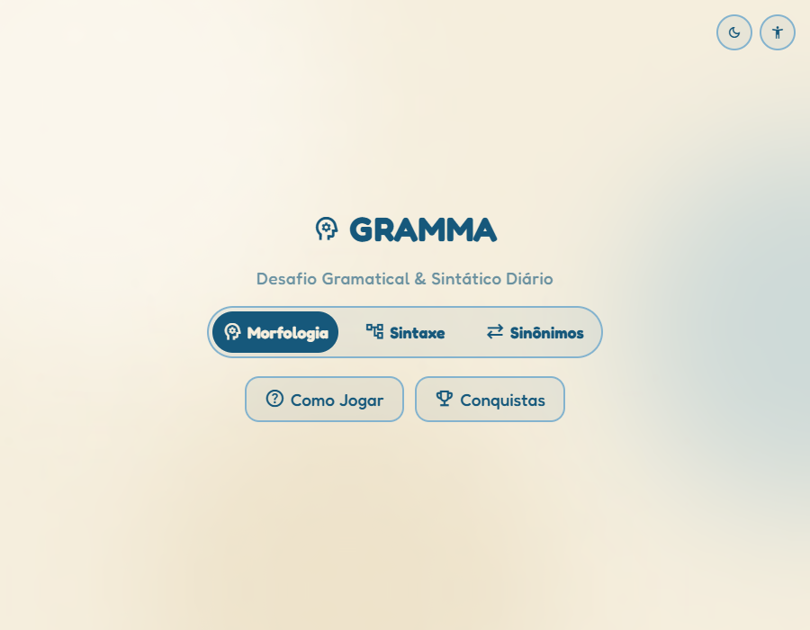

# GRAMMA

Desafio gramatical e sintático diário, no estilo Wordle/Termo — todo dia
traz uma frase nova para analisar morfologicamente ou sintaticamente, ou
uma palavra difícil para associar ao sinônimo certo.

**Jogue em: https://glaubermargem.github.io/Gramma/**



Projeto desenvolvido para a disciplina de Jogos Digitais (UniRios), com
apresentação prevista no **SIFGAMES em 27/10/2026**.

## O jogo

Ao abrir o GRAMMA, você escolhe um dos três modos de estudo e responde ao
desafio do dia — uma tentativa só, sem retry:

- **Morfologia** — identifique a classe gramatical da palavra em destaque.
- **Sintaxe** — identifique a função sintática da palavra em destaque.
- **Sinônimos** — escolha o sinônimo certo para uma palavra difícil, entre
  quatro opções.

Cada acerto some pontos (100/200/150, respectivamente) e a cada 5 acertos
seguidos no mesmo modo você ganha um bônus de +10%. O progresso fica salvo
no `localStorage`: ofensiva diária, conquistas por sequência de acertos, e
o calendário com os dias já jogados (venceu/perdeu/disponível).

Sem servidor, sem conta, sem backend — é só HTML/CSS/JS puro rodando no
seu navegador.

## Como rodar localmente

O jogo usa ES Modules (`<script type="module">`), que a maioria dos
navegadores bloqueia se você abrir o `index.html` direto pelo disco
(`file://`). Sirva a pasta por HTTP:

```bash
# com Python (já vem instalado na maioria dos sistemas)
python -m http.server 8000

# ou com Node, sem instalar nada globalmente
npx serve .
```

Depois abra `http://localhost:8000` no navegador.

## Estrutura do projeto

```
index.html               marcação de todas as telas
css/style.css             design system (temas claro/escuro, animações)
js/
  main.js                 orquestração: navegação, eventos, cutscene
  gameEngine.js            máquina de estados de uma partida
  scoreEngine.js           pontuação e bônus de sequência
  storageService.js        leitura/escrita do progresso (localStorage)
  achievements.js          catálogo de conquistas
  dataStore.js             acesso ao banco de frases (morfologia/sintaxe)
  synonymStore.js          acesso ao banco de sinônimos
  uiController.js          renderização das telas
  theme.js / accessibility.js   tema claro/escuro, tamanho de fonte
  vendor/gsap.min.js       GSAP (animações), vendorizado localmente
scripts/build-data.js      regenera js/database.js e js/synonymsDatabase.js
```

## Banco de dados

O conteúdo do jogo (frases de morfologia/sintaxe e palavras de sinônimos)
tem o `.json` como fonte oficial, editável por qualquer pessoa do time:

- `database_completo_365.json` — 365 dias de morfologia + sintaxe
- `database_sinonimos.json` — banco de palavras difíceis para o modo Sinônimos

O jogo em si **não lê esses `.json` diretamente** — ele importa os módulos
`js/database.js` e `js/synonymsDatabase.js`, que são cópias geradas a partir
dos JSON acima (evita `fetch`/CORS ao abrir o jogo direto pelo `file://`).

**Por isso: depois de editar qualquer um dos `.json`, rode**

```bash
node scripts/build-data.js
```

e commite os `.js` atualizados junto com o `.json`. Se pular esse passo, a
edição fica só no `.json` e nunca aparece dentro do jogo de verdade.

## Tecnologias

Vanilla JS (ES Modules, sem framework nem build step), CSS puro com
variáveis nativas para os temas, [GSAP](https://gsap.com/) para as
transições e animações, e ícones do
[Material Symbols](https://fonts.google.com/icons) do Google.

## Equipe

[GlauberMargem](https://github.com/GlauberMargem) ·
[Yurialvessmoreiraaa](https://github.com/Yurialvessmoreiraaa)
